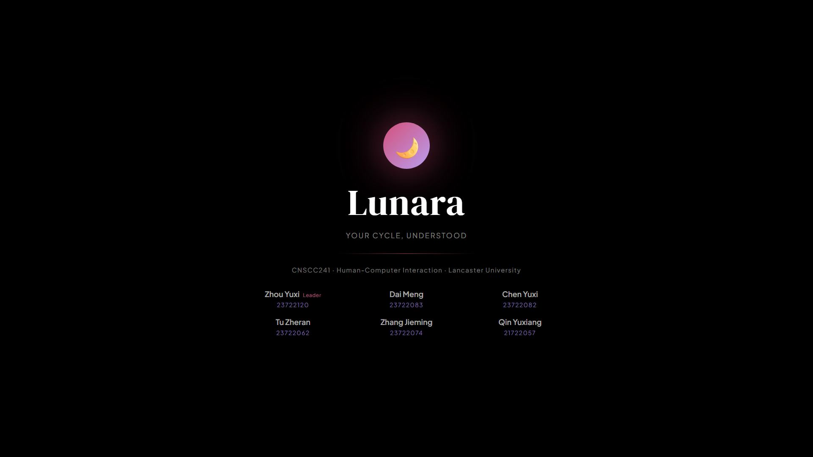
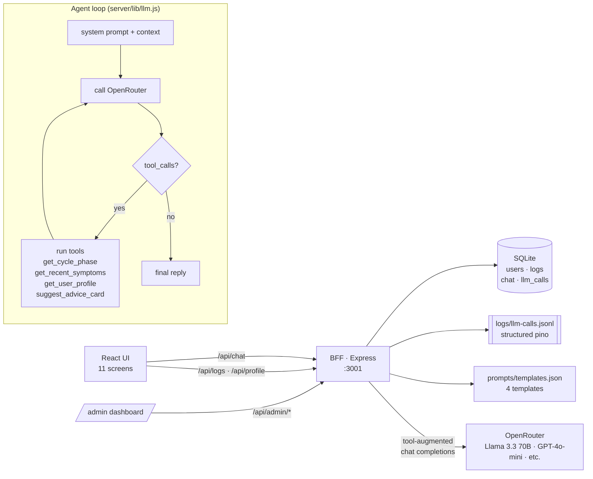

# 🌸 Lunara — Women's Health App with an LLM-Powered Agent

Lunara is a full-stack prototype of a women's health tracking app. The interesting half isn't the cycle calendar — it's the **AI Ops layer** wrapped around it: a BFF that turns a single LLM endpoint into a versioned, observable, agent-capable internal service.

This repository is structured as an applied portfolio piece for AI application development roles. It demonstrates **LLM capability wrapping, Prompt engineering & evaluation, an Agent loop with function calling, and the engineering scaffolding** (logging, configuration, persistence, admin tooling) that turns a one-off API call into something you could ship inside a company.

---

## 🎬 Demo Video

<a href="https://youtu.be/__qw5hSD710"></a>

> The demo video was produced entirely with **[Remotion](https://www.remotion.dev/)** (a React-based programmatic video framework) and **[Claude](https://www.anthropic.com/claude)** (Anthropic's AI). Every scene, transition, animation, and subtitle was generated through code — no traditional video editing software was used. The narration script, visual layout, and component logic were all authored collaboratively between the team and Claude, with Remotion rendering the final output frame-by-frame.

---

## Architecture



The browser never holds the API key. Every chat call runs through `/api/chat`, where the BFF (1) injects the user's cycle phase + 7-day log summary into the system prompt, (2) hands the LLM a curated set of tools, and (3) runs the tool-calling loop on the server.

---

## Job description ↔ repository map

This project was scoped against an "AI 应用开发实习生" JD. Each JD bullet maps to a concrete artefact:

| JD requirement | Where to find it |
| --- | --- |
| 封装大模型能力为可复用接口/服务 | `server/routes/chat.js`, `server/lib/llm.js` |
| Prompt 编写、调试与优化 | `server/prompts/templates.json`, `server/evals/` |
| Agent / 工作流式 AI 应用 | `server/lib/llm.js` (agent loop), `server/lib/tools.js` (4 tools) |
| AI 与业务系统集成 | `server/lib/context.js` injects business state into prompts; `src/api.js` wires the React UI |
| 内部 AI 工具 / 管理界面 | `src/screens/Admin.js` (templates / call log / token usage) |
| 日志、配置、权限 | `pino` JSONL logs · `prompts/templates.json` hot-editable config · bearer-token admin auth |
| AI 输出不确定性的调试与验证 | `server/evals/run.js`, `server/evals/RESULTS.md` |

---

## Quick start

```bash
# 1. Install deps
npm install
cd server && npm install && cd ..

# 2. Configure the BFF
cp server/.env.example server/.env
# edit server/.env — set OPENROUTER_API_KEY

# 3. Run both processes
cd server && npm start    # terminal 1 — BFF on :3001
npm start                 # terminal 2 — React UI on :3000

# Open http://localhost:3000               for the app
# Open http://localhost:3000/#/admin       for the admin dashboard
# Open http://localhost:3001/health        for a BFF health check
```

The UI gracefully degrades to rule-based responses if the BFF is offline, so you can browse the app without an API key.

To run the evaluation harness against a live LLM:

```bash
cd server
node evals/run.js
# writes evals/RESULTS.md
```

---

## What's interesting under the hood

**1. Prompt templates as data, not code.** Four templates live in `prompts/templates.json` — Default, Coach, Data Analyst, and a No-Context Baseline used as the evaluation control. Each template owns its system prompt, temperature, max tokens, and **the subset of tools it is allowed to call**. The same agent loop runs all four; behaviour changes are config changes.

**2. Context injection ("half-agent").** Before every call, the BFF runs `buildContext(userId)`: it reads the user's profile, derives the current cycle phase, and summarises the last 7 days of logs. That snapshot is appended to the system message. The model only needs to call tools when it wants to drill into longer windows or raw data — saving a round trip on most queries.

**3. Tool-calling agent loop.** `server/lib/llm.js` implements a bounded loop (max 4 turns) over OpenRouter's chat-completions endpoint. The four tools — `get_cycle_phase`, `get_recent_symptoms`, `get_user_profile`, `suggest_advice_card` — are real handlers reading from SQLite, not mocks.

**4. Audit-grade observability.** Every LLM round-trip writes a structured `pino` event to `logs/llm-calls.jsonl` *and* a row to the `llm_calls` table. The admin dashboard reads both: a call log table and a token-usage-by-day chart.

**5. An evaluation harness, not just vibes.** `evals/run.js` runs 18 cases across 4 categories (emotional support, factual cycle, pattern detection, edge cases) against three template configurations and writes a markdown comparison report. The headline result: adding context + tools roughly doubles the token cost but transforms generic answers into ones grounded in the user's actual logged data. See `evals/RESULTS.md`.

**6. Defence in depth.** No API key in the browser; admin endpoints behind a bearer token; tools whitelisted per template so a relaxed coach template cannot accidentally exfiltrate raw profile data through a tool that a stricter template would forbid.

---

## Project structure

```
lunara/
├── README.md                ← you are here
├── PORTFOLIO_PLAN.md        ← the 12-day build plan
├── PROJECT_STATEMENT.md     ← resume / interview project statement (two versions)
├── PUSH_INSTRUCTIONS.md     ← how to push to GitHub
├── Lunara_Case_Study.pdf    ← 5-page case study deliverable
├── package.json             ← React app
├── public/
├── src/                     ← React frontend
│   ├── api.js               ← single seam for all BFF calls
│   ├── App.js               ← state-based router + /#/admin escape hatch
│   ├── data.js              ← mock data, mood/symptom catalogues
│   ├── styles.css
│   └── screens/             ← 12 screens incl. AIChat.js + Admin.js
└── server/                  ← BFF
    ├── index.js             ← Express entry
    ├── package.json
    ├── .env.example
    ├── prompts/
    │   └── templates.json   ← 4 prompt templates (hot-editable)
    ├── lib/
    │   ├── llm.js           ← OpenRouter client + agent loop
    │   ├── tools.js         ← 4 function-calling tools
    │   ├── context.js       ← buildContext() — cycle phase + 7-day log summary
    │   ├── prompts.js       ← template registry
    │   ├── db.js            ← better-sqlite3 wrapper
    │   └── logger.js        ← pino w/ pretty + JSONL transports
    ├── routes/
    │   ├── chat.js          ← POST /api/chat, GET /api/chat/history
    │   ├── logs.js          ← daily-log persistence
    │   ├── profile.js       ← user profile persistence
    │   └── admin.js         ← bearer-protected templates / calls / usage
    ├── db/
    │   └── schema.sql
    └── evals/
        ├── test-cases.json  ← 18 cases × 4 categories
        ├── run.js           ← harness
        └── RESULTS.md       ← report
```

---

## Stack

- **Frontend**: React 18, no router (state-based) + a `/#/admin` hash escape hatch, vanilla CSS
- **Backend**: Node 20, Express, `better-sqlite3`, `pino`, `dotenv`, `cors`
- **LLM**: OpenRouter (default Llama 3.3 70B with function-calling; pluggable via `LLM_MODEL`)
- **No frameworks I didn't need**: no LangChain, no Next.js, no ORM. The Agent loop is ~80 lines.

---

## What I'd do next

- Replace SQLite with Postgres + an actual auth layer (currently single-tenant: `userId = 'demo-user'`).
- Stream tokens to the client instead of the current request/response shape.
- Pre-summarise tool results before returning them to the model — `get_recent_symptoms` is currently the biggest token sink.
- Add a CI step that runs `evals/run.js` against a small subset on every PR and fails on regression beyond a tolerance.
- Move the admin password to short-lived JWTs.
